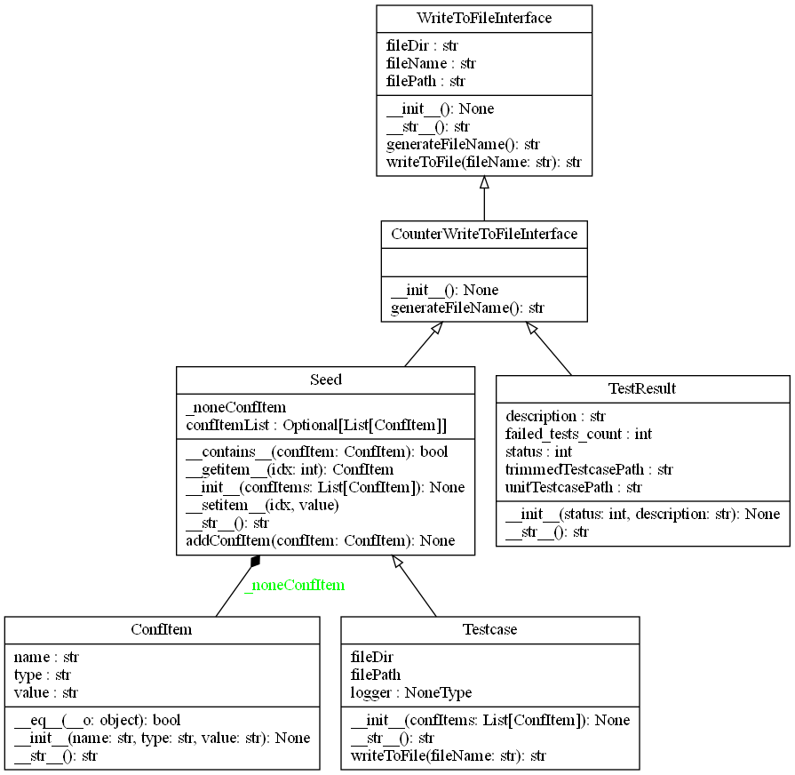

dataModel package
=================

Submodules
----------

dataModel.ConfItem module
-------------------------

.. automodule:: dataModel.ConfItem
   :members:
   :undoc-members:
   :show-inheritance:

dataModel.CounterWriteToFileInterface module
--------------------------------------------

.. automodule:: dataModel.CounterWriteToFileInterface
   :members:
   :undoc-members:
   :show-inheritance:

dataModel.Seed module
---------------------

.. automodule:: dataModel.Seed
   :members:
   :undoc-members:
   :show-inheritance:

dataModel.TestResult module
---------------------------

.. automodule:: dataModel.TestResult
   :members:
   :undoc-members:
   :show-inheritance:

dataModel.Testcase module
-------------------------

.. automodule:: dataModel.Testcase
   :members:
   :undoc-members:
   :show-inheritance:

dataModel.WriteToFileInterface module
-------------------------------------

.. automodule:: dataModel.WriteToFileInterface
   :members:
   :undoc-members:
   :show-inheritance:

Module contents
---------------

.. automodule:: dataModel
   :members:
   :undoc-members:
   :show-inheritance:
