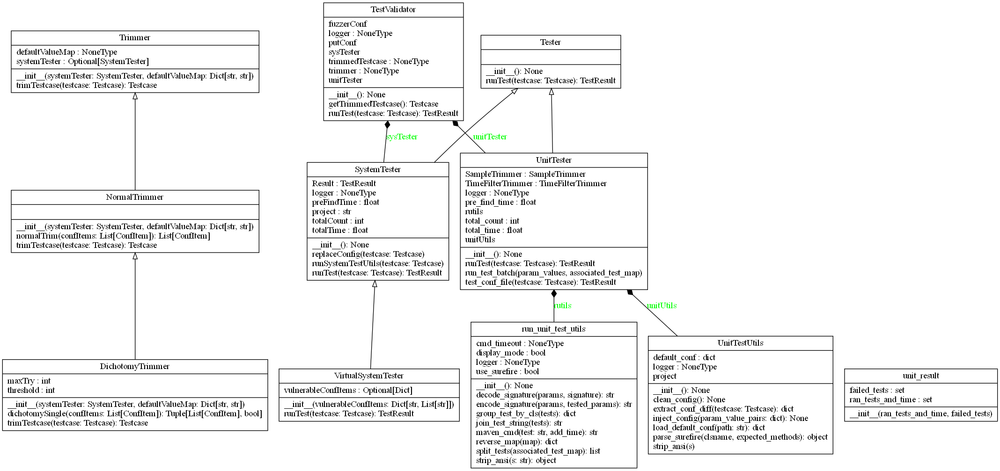

testValidator package
=====================

Submodules
----------

testValidator.DichotomyTrimmer module
-------------------------------------

.. automodule:: testValidator.DichotomyTrimmer
   :members:
   :undoc-members:
   :show-inheritance:

testValidator.NormalTrimmer module
----------------------------------

.. automodule:: testValidator.NormalTrimmer
   :members:
   :undoc-members:
   :show-inheritance:

testValidator.SystemTester module
---------------------------------

.. automodule:: testValidator.SystemTester
   :members:
   :undoc-members:
   :show-inheritance:

testValidator.TestValidator module
----------------------------------

.. automodule:: testValidator.TestValidator
   :members:
   :undoc-members:
   :show-inheritance:

testValidator.Tester module
---------------------------

.. automodule:: testValidator.Tester
   :members:
   :undoc-members:
   :show-inheritance:

testValidator.Trimmer module
----------------------------

.. automodule:: testValidator.Trimmer
   :members:
   :undoc-members:
   :show-inheritance:

testValidator.UnitTestUtils module
----------------------------------

.. automodule:: testValidator.UnitTestUtils
   :members:
   :undoc-members:
   :show-inheritance:

testValidator.UnitTester module
-------------------------------

.. automodule:: testValidator.UnitTester
   :members:
   :undoc-members:
   :show-inheritance:

testValidator.VirtualSystemTester module
----------------------------------------

.. automodule:: testValidator.VirtualSystemTester
   :members:
   :undoc-members:
   :show-inheritance:

testValidator.run\_unit\_test\_utils module
-------------------------------------------

.. automodule:: testValidator.run_unit_test_utils
   :members:
   :undoc-members:
   :show-inheritance:

testValidator.unit\_result module
---------------------------------

.. automodule:: testValidator.unit_result
   :members:
   :undoc-members:
   :show-inheritance:

Module contents
---------------

.. automodule:: testValidator
   :members:
   :undoc-members:
   :show-inheritance:
