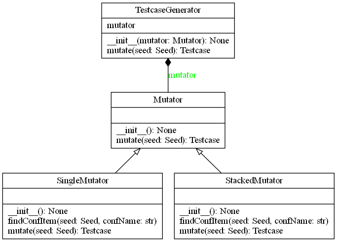

testcaseGenerator package
=========================

Submodules
----------

testcaseGenerator.Mutator module
--------------------------------

.. automodule:: testcaseGenerator.Mutator
   :members:
   :undoc-members:
   :show-inheritance:

testcaseGenerator.SingleMutator module
--------------------------------------

.. automodule:: testcaseGenerator.SingleMutator
   :members:
   :undoc-members:
   :show-inheritance:

testcaseGenerator.StackedMutator module
---------------------------------------

.. automodule:: testcaseGenerator.StackedMutator
   :members:
   :undoc-members:
   :show-inheritance:

testcaseGenerator.TestcaseGenerator module
------------------------------------------

.. automodule:: testcaseGenerator.TestcaseGenerator
   :members:
   :undoc-members:
   :show-inheritance:

Module contents
---------------

.. automodule:: testcaseGenerator
   :members:
   :undoc-members:
   :show-inheritance:
