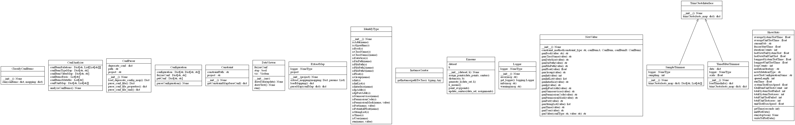

utils package
=============

Submodules
----------

utils.ClassifyConfItems module
------------------------------

.. automodule:: utils.ClassifyConfItems
   :members:
   :undoc-members:
   :show-inheritance:

utils.ConfAnalyzer module
-------------------------

.. automodule:: utils.ConfAnalyzer
   :members:
   :undoc-members:
   :show-inheritance:

utils.ConfParser module
-----------------------

.. automodule:: utils.ConfParser
   :members:
   :undoc-members:
   :show-inheritance:

utils.Configuration module
--------------------------

.. automodule:: utils.Configuration
   :members:
   :undoc-members:
   :show-inheritance:

utils.Constraint module
-----------------------

.. automodule:: utils.Constraint
   :members:
   :undoc-members:
   :show-inheritance:

utils.ExtractMap module
-----------------------

.. automodule:: utils.ExtractMap
   :members:
   :undoc-members:
   :show-inheritance:

utils.IdentifyType module
-------------------------

.. automodule:: utils.IdentifyType
   :members:
   :undoc-members:
   :show-inheritance:

utils.Kmeans module
-------------------

.. automodule:: utils.Kmeans
   :members:
   :undoc-members:
   :show-inheritance:

utils.SampleTrimmer module
--------------------------

.. automodule:: utils.SampleTrimmer
   :members:
   :undoc-members:
   :show-inheritance:

utils.TimeFilterTrimmer module
------------------------------

.. automodule:: utils.TimeFilterTrimmer
   :members:
   :undoc-members:
   :show-inheritance:

utils.TrimCtestsInterface module
--------------------------------

.. automodule:: utils.TrimCtestsInterface
   :members:
   :undoc-members:
   :show-inheritance:

utils.UnitConstant module
-------------------------

.. automodule:: utils.UnitConstant
   :members:
   :undoc-members:
   :show-inheritance:

utils.Logger module
-------------------

.. automodule:: utils.Logger
   :members:
   :undoc-members:
   :show-inheritance:

utils.InstanceCreator module
----------------------------

.. automodule:: utils.InstanceCreator
   :members:
   :undoc-members:
   :show-inheritance:

Module contents
---------------

.. automodule:: utils
   :members:
   :undoc-members:
   :show-inheritance:
